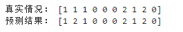
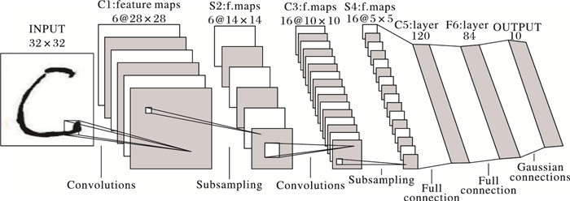
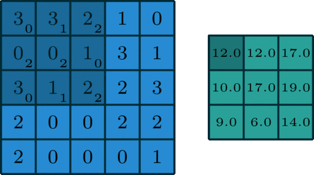

# Task03 - 字符识别模型

> 特点对于字符识别模型，为了区分字符之间的差异，这种模型往往又通用的方式叫做分类器模型，但图片字符模型在训练上存在多维度情况。

## 1. 机器学习的字符分类

### 1.1. 机器学习：K-近邻算法（KNN）

#### 1.1.1. 简介

KNN作为一种有监督分类算法，是最简单的机器学习算法之一，顾名思义，其算法主体思想就是根据距离相近的邻居类别，来判定自己的所属类别。算法的前提是需要有一个已被标记类别的训练数据集，具体的计算步骤分为一下三步：

1. 计算测试对象与训练集中所有对象的距离，可以是欧式距离、余弦距离等，比较常用的是较为简单的欧式距离；

2. 找出上步计算的距离中最近的K个对象，作为测试对象的邻居；

3. 找出K个对象中出现频率最高的对象，其所属的类别就是该测试对象所属的类别。

#### 1.1.2. 小结

|缺点|注意点|
|-----|-----|
|懒惰算法，进行分类时计算量大，要扫描全部训练样本计算距离，内存开销大，评分慢；当样本不平衡时，如其中一个类别的样本较大，可能会导致对新样本计算近邻时，大容量样本占大多数，影响分类效果；可解释性较差，无法给出决策树那样的规则。|[**K值的设定**] K值设置过小会降低分类精度；若设置过大，且测试样本属于训练集中包含数据较少的类，则会增加噪声，降低分类效果。 通常，K值的设定采用交叉检验的方式（以K=1为基准） `经验规则：K一般低于训练样本数的平方根`。 <br> [**优化问题**] 压缩训练样本； 确定最终的类别时，不是简单的采用投票法，而是进行加权投票，距离越近权重越高。|

#### 1.1.3. Scikit-Learn 代码实现
```python
#KNN调用
import numpy as np
from sklearn import datasets

# 加载数据
iris = datasets.load_iris()
iris_X = iris.data
iris_y = iris.target

# Split iris data in train and test data
# A random permutation, to split the data randomly
np.unique(iris_y)
np.random.seed(0)

# permutation随机生成一个范围内的序列
indices = np.random.permutation(len(iris_X))

# 通过随机序列将数据随机进行测试集和训练集的划分
iris_X_train = iris_X[indices[:-10]]
iris_y_train = iris_y[indices[:-10]]
iris_X_test  = iris_X[indices[-10:]]
iris_y_test  = iris_y[indices[-10:]]

# Create and fit a nearest-neighbor classifier
from sklearn.neighbors import KNeighborsClassifier
knn = KNeighborsClassifier(algorithm='auto', leaf_size=30, metric='minkowski',
           metric_params=None, n_jobs=1, n_neighbors=5, p=2,
           weights='uniform')
knn.fit(iris_X_train, iris_y_train) 
# 训练的结果
predict_y_test = knn.predict(iris_X_test)
print('真实情况：', iris_y_test)
print('预测结果：', predict_y_test)

```


## 2. 神经网络分类 CNN

> 卷积神经网络（简称CNN）是一类特殊的人工神经网络，是深度学习中重要的一个分支。CNN在很多领域都表现优异，精度和速度比传统计算学习算法高很多。特别是在计算机视觉领域，CNN是解决图像分类、图像检索、物体检测和语义分割的主流模型。


### 2.1. 图片分类常用的基本模型

LeNet-5——CNN经典网络模型详解（pytorch实现）

AlexNet–CNN经典网络模型详解（pytorch实现）

VGG——CNN经典网络模型（pytorch实现）

GoogLeNet——CNN经典网络模型详解（pytorch实现）

ResNet——CNN经典网络模型详解(pytorch实现)

DenseNet——CNN经典网络模型详解(pytorch实现)

MobileNet(v1、v2)——CNN经典网络模型详解（pytorch实现）

### 2.2. 案例 - 以LeNet-5为例

LeNet-5是CNN的经典例子，用于手写体数字字符识别，其网络结构如下



最经典的就是 MNIST 集合的训练方式

#### 2.2.1. 卷积操作

二维卷积是一个相当简单的操作：从卷积核开始，这是一个小的权值矩阵。这个卷积核在 2 维输入数据上 `滑动` ，对当前输入的部分元素进行矩阵乘法，然后将结果汇为单个输出像素。




#### 2.2.2. 代码实现

> 具体的包含数据扩展和训练结果查看 [BaseLine](Task02-BaseLine.ipynb)

```python
import torch
torch.manual_seed(0)
torch.backends.cudnn.deterministic = False
torch.backends.cudnn.benchmark = True
import torchvision.models as models
import torchvision.transforms as transforms
import torchvision.datasets as datasets
import torch.nn as nn
import torch.nn.functional as F
import torch.optim as optim
from torch.autograd import Variable
from torch.utils.data.dataset import Dataset

# 定义模型

class SVHN_Model1(nn.Module):
    def __init__(self):
        super(SVHN_Model1, self).__init__()
        # CNN提取特征模块
        self.cnn = nn.Sequential(
            nn.Conv2d(3, 16, kernel_size=(3, 3), stride=(2, 2)),
            nn.ReLU(), 
            nn.MaxPool2d(2),
            nn.Conv2d(16, 32, kernel_size=(3, 3), stride=(2, 2)),
            nn.ReLU(),
            nn.MaxPool2d(2),
        )
        # 全连接层
        self.fc1 = nn.Linear(32*3*7, 11)
        self.fc2 = nn.Linear(32*3*7, 11)
        self.fc3 = nn.Linear(32*3*7, 11)
        self.fc4 = nn.Linear(32*3*7, 11)
        self.fc5 = nn.Linear(32*3*7, 11)
        self.fc6 = nn.Linear(32*3*7, 11)

    def forward(self, img):       
        feat = self.cnn(img)
        feat = feat.view(feat.shape[0], -1)
        c1 = self.fc1(feat)
        c2 = self.fc2(feat)
        c3 = self.fc3(feat)
        c4 = self.fc4(feat)
        c5 = self.fc5(feat)
        c6 = self.fc6(feat)
        return c1, c2, c3, c4, c5, c6

# 构建模型
model = SVHN_Model1()

# 损失函数
criterion = nn.CrossEntropyLoss()

# 优化器
optimizer = torch.optim.Adam(model.parameters(), 0.005)
loss_plot, c0_plot = [], []

# 迭代10个Epoch
for epoch in range(10):
    for data in train_loader:
        c0, c1, c2, c3, c4, c5 = model(data[0])
        loss = criterion(c0, data[1][:, 0]) + \
                criterion(c1, data[1][:, 1]) + \
                criterion(c2, data[1][:, 2]) + \
                criterion(c3, data[1][:, 3]) + \
                criterion(c4, data[1][:, 4]) + \
                criterion(c5, data[1][:, 5])
        loss /= 6
        optimizer.zero_grad()
        loss.backward()
        optimizer.step()
        loss_plot.append(loss.item())
        c0_plot.append((c0.argmax(1) == data[1][:, 0]).sum().item()*1.0 / c0.shape[0])
    print(epoch)
```
#### 2.2.3. 代码改进

为了提升模型的泛化能力，能在短时间内收敛到较好的结果，可以使用预训练模型：ImageNet 训练模型加入当前模型中，将模型结果进行局部的调整。

```python

class SVHN_Model(torch.nn.Module):
    def __init__(self, path=None):
        super(SVHN_Model, self).__init__()
        if path is None:
            model_conv = models.resnet18(pretrained=True)
        else:
            model_conv = models.resnet18(pretrained=False)
            model_conv.load_state_dict(torch.load(path))
        model_conv.avgpool = torch.nn.AdaptiveAvgPool2d(1)
        model_conv = torch.nn.Sequential(*list(model_conv.children())[:-1])
        self.cnn = model_conv
        # 每个字符有11中情况
        self.fc1 = torch.nn.Linear(512, 11)
        self.fc2 = torch.nn.Linear(512, 11)
        self.fc3 = torch.nn.Linear(512, 11)
        self.fc4 = torch.nn.Linear(512, 11)
        self.fc5 = torch.nn.Linear(512, 11)
    def forward(self, img):
        # activation function for
        # 容易过拟合导致准确度下降
        feat = self.cnn(img)
        feat = feat.view(feat.shape[0], -1)
        feat = F.dropout2d(feat)
        # 排除其他无关元素影响，只留正相关因素
        c1 = self.fc1(feat)
        c2 = self.fc2(feat)
        c3 = self.fc3(feat)
        c4 = self.fc4(feat)
        c5 = self.fc5(feat)
        return c1, c2, c3, c4, c5
```