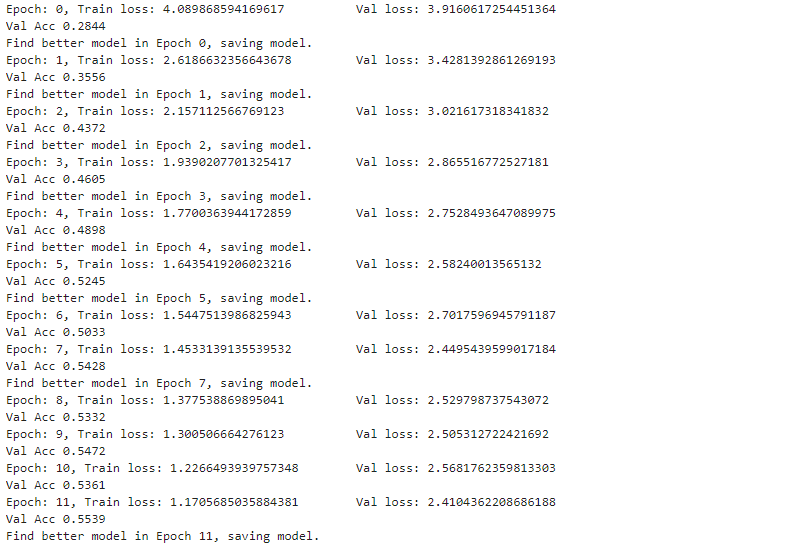
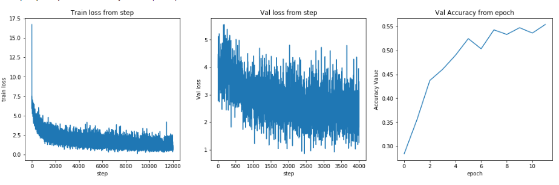

# Task04 - 模型训练与验证

## 1. 过拟合&欠拟合

### 1.1. 概念

**过拟合** 是指所选模型的复杂度比真模型更高，学习时选择的模型所包含的参数过多，对已经数据预测得很好，但是对未知数据预测得很差得现象。

**欠拟合** 是指所选模型得复杂度比真模型更低，学习时选择的模型所包含的参数过少

### 1.2. 存在的差异原因

机器学习中没有免费的午餐，表明在所有可能的数据生成平均分布之后，每个分类算法在事后先观测的点存在的错误概率是一致的，设计算法必须在特定的任务上进行设计。
在训练上存在训练误差，一方面降低训练误差，而我们度量的是的测试误差，来评估机器学习模型的泛化能力和误差。

在线性回归实例中，通过最小化训练误差训练模型

$$\frac{1}{m^{train}}\parallel X^{train} w - y^{train} \parallel^2_2$$

但是我们观察的是测试训练误差

$$\frac{1}{m^{test}}\parallel X^{test} w - y^{test} \parallel^2_2$$

通常七年高考下测试的误差期望会大于或等于训练误差期望。 决定其算法训练效果因素是：

**(1)** 降低训练误差

**(2)** 缩小训练误差和测试误差的差距

### 1.3. 根据上述的措施

1） Early stopping：在模型对训练数据集迭代收敛之前停止迭代来防止过拟合

2） 数据集扩增：既需要得到更多符合要求的数据，即和已有数据是独立同分布的，或者近似独立同分布的。一般的方法有：从数据源头采集更多的数据，复制原有数据并加上随机噪声，重采

样，根据当前数据集估计数据分布参数，使用该分布产生更多数据等。过拟合的主要原因是模型太努力去记住训练样本的分布情况，而加大样本量，可以使得训练集的分布更加具备普适性，噪声对整体的影响下降。

3） 正则化方法：一般有L1正则和L2正则等

4） Dropout：正则是通过在代价函数后面加上正则项来防止模型过拟合的。而在神经网络中，有一种方法是通过修改神经网络本身结构来实现的，即dropout。


## 2. 模型验证

### 2.1. 概念

解决上述问题最好的解决方法：构建一个与测试集尽可能分布一致的样本集（可称为验证集），在训练过程中不断验证模型在验证集上的精度，并以此控制模型的训练。

一般情况下，参赛选手也可以自己在本地划分出一个验证集出来，进行本地验证。训练集、验证集和测试集分别有不同的作用：

* 训练集（Train Set）：模型用于训练和调整模型参数

* 验证集（Validation Set）：用来验证模型精度和调整模型超参数

* 测试集（Test Set）：验证模型的泛化能力

因为训练集和验证集是分开的，所以模型在验证集上面的精度在一定程度上可以反映模型的泛化能力。在划分验证集的时候，需要注意验证集的分布应该与测试集尽量保持一致，不然模型在验证集上的精度就失去了指导意义


### 2.2. 基本方式

赛题方会给定验证集；如果赛题方没有给定验证集，那么参赛选手就需要从训练集中拆分一部分得到验证集。验证集的划分有如下几种方式：

**1. 留出法（Hold-Out）**

直接将训练集划分成两部分，新的训练集和验证集。这种划分方式的优点是最为直接简单；缺点是只得到了一份验证集，有可能导致模型在验证集上过拟合。留出法应用场景是数据量比较大的情况

**2. 交叉验证法（Cross Validation，CV）**

将训练集划分成K份，将其中的K-1份作为训练集，剩余的1份作为验证集，循环K训练。这种划分方式是所有的训练集都是验证集，最终模型验证精度是K份平均得到。这种方式的优点是验证集精度比较可靠，训练K次可以得到K个有多样性差异的模型；CV验证的缺点是需要训练K次，不适合数据量很大的情况

**3. 自助采样法（BootStrap）**

通过有放回的采样方式得到新的训练集和验证集，每次的训练集和验证集都是有区别的。这种划分方式一般适用于数据量较小的情况。

## 3. 代码实现

通过 `pytorch` 预训练模型 `resent18`迁移 和 `fc` 层组合的复合CNN模型。 已经加载好的验证数据和训练数据进行训练与监控泛化误差。 
完整代码请参考[BaseLine](Task02-BaseLine.ipynb)，基本步骤如下：

> 1. 构造分割验证集和训练集
> 2. 每轮进行训练和验证，根据最优的精度和 训练误差 和 验证误差 确认泛化误差。
> 3. 保存验证精度最高的模型参数


### 3.1. 构造分割验证集和训练集
```python 

import sys

EPOCH = 12
BATCH_SIZE = 30
USE_CUDA = True

train_loader = ud.DataLoader(
    dataset=SVHDataset('Datasets/mchar_train/*.png', 'Datasets/mchar_train.json', data_transforms['train']),
    batch_size=BATCH_SIZE,
    shuffle=True,
    # num_workers 在windows上报错 设置改为 0
    num_workers= (0 if sys.platform.startswith('win') else 10)
)
val_loader = ud.DataLoader(
    dataset=SVHDataset('Datasets/mchar_val/*.png', 'Datasets/mchar_val.json', data_transforms['val']),
    batch_size=BATCH_SIZE,
    shuffle=False,
    # num_workers 在windows上报错 设置改为 0
    num_workers= (0 if sys.platform.startswith('win') else 10)
)

```

### 3.2 定义每轮模型预测和训练方法

```python

from functools import reduce

# 检测训练误差，梯度反向传递
def train_def(train_loader, model, loss_func, optimizer):
    
    # 切换模型为训练模式
    model.train()
    train_loss = []

    for step, (batch_x, batch_y) in enumerate(train_loader):
        # train your data...
        if USE_CUDA:
            batch_x = batch_x.cuda()
            # 将 float32 强制转换为 long
            batch_y = batch_y.long().cuda()
        predicate = model(batch_x)
        # 对应个位置上的字符 -> [11情况概率] <=> [label真实值]
        loss = reduce(lambda x, y: x + y, [loss_func(predicate[m], batch_y[:, m]) for m in range(batch_y.shape[1])])
        optimizer.zero_grad()
        loss.backward()
        optimizer.step()
        train_loss.append(loss.item())
    return np.array(train_loss)
 
# 检测验证误差
def validate_def(val_loader, model, loss_func):
    # 切换模型为预测模型
    model.eval()
    val_loss = []
    # 不记录模型梯度信息
    with torch.no_grad():
        for step, (batch_x, batch_y) in enumerate(val_loader):
            if USE_CUDA:
                batch_x = batch_x.cuda()
                # 将 float32 强制转换为 long
                batch_y = batch_y.long().cuda()
            predicate = model(batch_x)
            # 叠加 loss_func
            loss = reduce(lambda x, y: x + y, [loss_func(predicate[m], batch_y[:, m]) for m in range(batch_y.shape[1])])
            val_loss.append(loss.item())
    return np.array(val_loss)

# 预测方法
def predict_def(test_loader, model, tta=10):
    
    model.eval()
    test_pred_tta, test_target_tta = None, None

    # TTA 次数
    for _ in range(tta):
        test_pred, test_target = [], []
        with torch.no_grad():
            for step, (batch_x, batch_y) in enumerate(test_loader):
                if USE_CUDA:
                    batch_x = batch_x.cuda()
                    batch_y = batch_y.long().cuda()
                predicate_y = model(batch_x)
                output = torch.stack(predicate_y, dim=1)
                # 最大概率的索引值
                output = torch.argmax(output, dim=2)
                test_pred.append(output)
                test_target.append(batch_y)
                
        test_pred, test_target = torch.cat(test_pred), torch.cat(test_target)
        
        if test_pred_tta is None:
            test_pred_tta, test_target_tta = test_pred, test_target
        else:
            test_pred_tta += test_pred
            test_target_tta += test_target
    return test_pred_tta, test_target_tta

```

### 3.3 执行模型训练与验证

```python

model = SVHN_Model()  # define the network
if USE_CUDA:
    model = model.cuda()

# 开启训练模式

optimizer = torch.optim.Adam(model.parameters(),lr=0.001)
# the target label is NOT an one-hotted
loss_func = torch.nn.CrossEntropyLoss()

best_loss = 15

train_loss_list = []
val_loss_list = []
val_char_acc_list = []

for epoch in range(EPOCH):
    
    # 损失得分
    train_loss = train_def(train_loader, model, loss_func, optimizer)
    val_loss = validate_def(val_loader, model, loss_func)
    
    # 预测值结果与真实值比较关联
    val_predict_label, val_target_label = predict_def(val_loader, model, 1)
    val_label_pred = np.array([''.join(map(lambda x: str(x.item()), labels[labels!=10])) for labels in val_predict_label])
    val_label_target = np.array([''.join(map(lambda x: str(x.item()), labels[labels!=10])) for labels in val_target_label])
    
    # score 评价得分
    val_char_acc = np.sum(val_label_pred == val_label_target) / len(val_label_target)
    
    #将值添加到list
    train_loss_list.append(train_loss)
    val_loss_list.append(val_loss)
    val_char_acc_list.append(val_char_acc)
    
    print('Epoch: {0}, Train loss: {1} \t Val loss: {2}'.format(epoch, np.mean(train_loss), np.mean(val_loss)))
    print('Val Acc', val_char_acc)
    
    # 记录下验证集最佳精度
    if np.mean(val_loss) < best_loss:
        best_loss = np.mean(val_loss)
        print('Find better model in Epoch {0}, saving model.'.format(epoch))
        # 保存模型参数
        torch.save(model.state_dict(), './model.pt')

```

训练验证，每一次`Epoch`执行结果如下：



### 3.4 绘制泛化误差对比图



执行可视化对应代码：

```python
import matplotlib.pyplot as plt
import seaborn as sns
sns.set_style()
train_loss = np.hstack(np.array(train_loss_list))
print(train_loss.shape)
plt.figure(figsize=(18, 5))
plt.subplot(1, 3, 1)
plt.plot(train_loss)
plt.xlabel('step')
plt.ylabel('train loss')
plt.title('Train loss from step')
plt.subplot(1, 3, 2)
val_loss = np.hstack(np.array(val_loss_list))
plt.plot(val_loss)
plt.xlabel('step')
plt.ylabel('Val loss')
plt.title('Val loss from step')
plt.subplot(1, 3, 3)
plt.plot(val_char_acc_list)
plt.xlabel('epoch')
plt.ylabel('Accuracy Value')
plt.title('Val Accuracy from epoch')

```

## 4. 总结

1. 初步构建简单的CNN模型，不用特别复杂，跑通训练、验证和预测的流程；
2. 简单CNN模型的损失会比较大，尝试增加模型复杂度，并观察验证集精度；
3. 在增加模型复杂度的同时增加数据扩增方法，直至验证集精度不变。