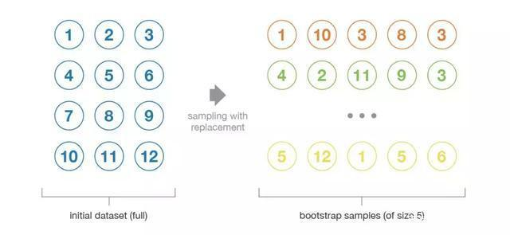
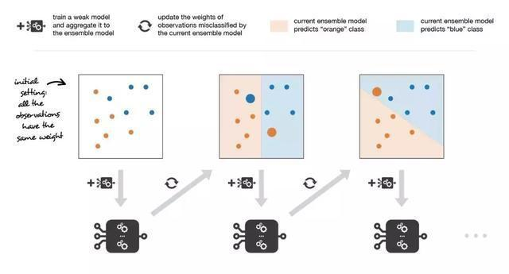
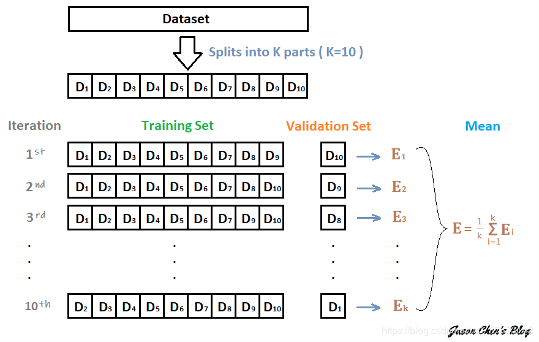
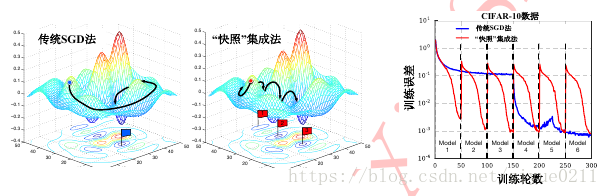

# Task05 - 模型集成

## 1. 何为集成方式

集成学习是一种机器学习范式。在集成学习中，我们会训练多个模型（通常称为`弱学习器`）解决相同的问题，并将它们结合起来以获得更好的结果。最重要的假设是：当弱模型被正确组合时，我们可以得到更精确和/或更鲁棒的模型。

在大多数情况下，这些基本模型本身的性能并不是非常好，这要么是因为它们具有较高的偏置（例如，低自由度模型），要么是因为他们的方差太大导致鲁棒性不强（例如，高自由度模型）。
这个就有点类似多分类器组合形成强复合模型

## 2. 组合相关弱分类器

我们可以用三种主要的旨在组合弱学习器的「元算法」：

* bagging，该方法通常考虑的是同质弱学习器，相互独立地并行学习这些弱学习器，并按照某种确定性的平均过程将它们组合起来。
* boosting，该方法通常考虑的也是同质弱学习器。它以一种高度自适应的方法顺序地学习这些弱学习器（每个基础模型都依赖于前面的模型），并按照某种确定性的策略将它们组合起来。
* stacking，该方法通常考虑的是异质弱学习器，并行地学习它们，并通过训练一个「元模型」将它们组合起来，根据不同弱模型的预测结果输出一个最终的预测结果。

### 2.1 bagging (自助法)

这种统计技术先随机抽取出作为替代的 B 个观测值，然后根据一个规模为 N 的初始数据集生成大小为 B 的样本（称为自助样本）。



必须验证两个方面的假设: 
1. 首先初始数据集的大小 N 应该足够大，以捕获底层分布的大部分复杂性。这样，从数据集中抽样就是从真实分布中抽样的良好近似（代表性）。
2. 与自助样本的大小 B 相比，数据集的规模 N 应该足够大，这样样本之间就不会有太大的相关性（独立性）。注意，接下来我可能还会提到自助样本的这些特性（代表性和独立性），但读者应该始终牢记：「这只是一种近似」。

我们可以使用自助法生成一些自助样本，它们可被视为「最具代表性」以及「最具独立性」（几乎是独立同分布的样本）的样本。这些自助样本使我们可以通过估计每个样本的值，近似得到估计量的方差。


### 2.2 boosting(提升法)

Boosting 方法和bagging 方法的工作思路是一样的：我们构建一系列模型，将它们聚合起来得到一个性能更好的强学习器。然而，与重点在于减小方差的 bagging 不同，boosting 着眼于以一种适应性很强的方式顺序拟合多个弱学习器：序列中每个模型在拟合的过程中，会更加重视那些序列中之前的模型处理地很糟糕的观测数据。

每个模型都把注意力集中在目前最难拟合的观测数据上。这样一来，在这个过程的最后，我们就获得了一个具有较低偏置的强学习器（我们会注意到，boosting 也有减小方差的效果）。和 bagging 一样，Boosting 也可以用于回归和分类问题。

由于其重点在于减小偏置，用于 boosting 的基础模型通常是那些低方差高偏置的模型。例如，如果想要使用树作为基础模型，我们将主要选择只有少许几层的较浅决策树。

而选择低方差高偏置模型作为 boosting 弱学习器的另一个重要原因是：这些模型拟合的计算开销较低（参数化时自由度较低）。

实际上，由于拟合不同模型的计算无法并行处理（与 bagging 不同），顺序地拟合若干复杂模型会导致计算开销变得非常高

简而言之，这两种元算法在顺序化的过程中创建和聚合弱学习器的方式存在差异。自适应增强算法会更新附加给每个训练数据集中观测数据的权重，而梯度提升算法则会更新这些观测数据的值。这里产生差异的主要原因是：两种算法解决优化问题（寻找最佳模型——弱学习器的加权和）的方式不同。

在自适应 boosting（通常被称为「adaboost」）中，我们将集成模型定义为 L 个弱学习器的加权和 

$$s_L \left( \cdot \right) = \sum^{L}_{i=1} c_l \times w_l \left( \cdot \right) $$

其中 $c_l$ 是系数为 $w_l$ 的弱分类


寻找这种最佳集成模型是一个「困难的优化问题」。因此，我们并没打算一次性地解决该问题（找到给出最佳整体加法模型的所有系数和弱学习器），而是使用了一种更易于处理的「迭代优化过程」（即使它有可能导致我们得到次优解）。

我们将弱学习器逐个添加到当前的集成模型中，在每次迭代中寻找可能的最佳组合（系数、弱学习器）。换句话说，我们循环地将 $s_l$ 定义如下：

$$ s_l\left( \cdot \right) = s_{l-1} \left( \cdot \right) + c_l \times w_l$$

其中，$c_l$ 和 $w_l$ 被挑选出来，使得 $s_l$ 是最适合训练数据的模型，因此这是对 $s_{\left(l-1\right)}$ 的最佳可能改进。我们可以进一步将其表示为

$$ \left( c_l, w_l\left( \cdot \right)\right) = arg_{c,w\left( \cdot \right)} minE\left( s_{l-1} \left( \cdot \right) + c \times w \left( \cdot \right) \right)$$

因此，假设我们面对的是一个二分类问题：数据集中有 N 个观测数据，我们想在给定一组弱模型的情况下使用 adaboost 算法。在算法的起始阶段（序列中的第一个模型），所有的观测数据都拥有相同的权重「1/N」。然后，我们将下面的步骤重复 L 次（作用于序列中的 L 个学习器）：

* 用当前观测数据的权重拟合可能的最佳弱模型
* 计算更新系数的值，更新系数是弱学习器的某种标量化评估指标，它表示相对集成模型来说，该弱学习器的分量如何
* 通过添加新的弱学习器与其更新系数的乘积来更新强学习器
* 计算新观测数据的权重，该权重表示我们想在下一轮迭代中关注哪些观测数据（聚和模型预测错误的观测数据的权重增加，而正确预测的观测数据的权重减小）
* 重复这些步骤，我们顺序地构建出 L 个模型，并将它们聚合成一个简单的线性组合，然后由表示每个学习器性能的系数加权。注意，初始 adaboost 算法有一些变体，比如 LogitBoost（分类）或 L2Boost（回归），它们的差异主要取决于损失函数的选择。



### 2.3 Stacking 概述

Stacking 与 bagging 和 boosting 主要存在两方面的差异。首先，Stacking 通常考虑的是异质弱学习器（不同的学习算法被组合在一起），而bagging 和 boosting 主要考虑的是同质弱学习器。其次，stacking 学习用元模型组合基础模型，而 `bagging` 和 `boosting` 则根据确定性算法组合弱学习器。

例如，对于分类问题来说，我们可以选择 KNN 分类器、logistic 回归和SVM 作为弱学习器，并决定学习神经网络作为元模型。然后，神经网络将会把三个弱学习器的输出作为输入，并返回基于该输入的最终预测。

对于任意的观测数据，弱学习器的预测都是通过在 k-1 折数据（不包含已考虑的观测数据）上训练这些弱学习器的实例来完成的.



### 2.4 网络快照集成法 (snapshot ensemble)

深度神经网络模型复杂的解空间存在非常多的局部最优解， 但经典的随机梯度下降方法只能让网络模型收敛到其中一个局部最优解。 网络快照便利用了网络解空间中这些局部最优解来对单个网络做模型集成。 通过循环调整网络的学习率可使网络依次收敛到不同的局部最优解。




 网络快照法是将学习率η设置为随模型迭代轮数t（iteration，即一次批处理随机梯度下降称为一个迭代轮数）改变的函数，即：


 $$\eta(t) = \frac{\eta_0}{2}(cos(\frac{\pi mod(t-1,[T/M])}{[T/M]})+1)$$

 其中，$\eta_0$ 为初始学习率， 一般设置为 0.1, 0.2。 $t$为模型迭代轮数(即mini-batch批处理训练次数)。$T$ 为模型总的批处理训练次数。 M为学习率“循环退火”的次数。 对应了模型将收敛到的局部最优解的个数。 式子用 $cos$ 的循环性来更新学习率， 将学习率从0.1 随 $t$ 的增长逐渐减缓到0， 之后学习率重新放大而跳出局部最优解。自此开始下一个循环，此循环结束可以收敛到新的局部最优解， 如此循环往复……直到M个循环结束。 上面用余弦函数循环更新网络参数，这一过程称之为“循环余弦退火”过程。


 ## 3. K-Flod 训练多个FC模型

> 1. 平均法：将10个模型预测结果的概率取平均值，然后解码为具体字符
> 2. 投票法：对10个模型预测结果进行投票，得到最终字符

```python
import torch
torch.manual_seed(0)
torch.backends.cudnn.deterministic = False
torch.backends.cudnn.benchmark = True
import torchvision.models as models
import torchvision.transforms as transforms
import torchvision.datasets as datasets
import torch.nn as nn
import torch.nn.functional as F
import torch.optim as optim
from torch.autograd import Variable
from torch.utils.data.dataset import Dataset

# 定义模型

class SVHN_Model1(nn.Module):
    def __init__(self):
        super(SVHN_Model1, self).__init__()
        # CNN提取特征模块
        self.cnn = nn.Sequential(
            nn.Conv2d(3, 16, kernel_size=(3, 3), stride=(2, 2)),
            nn.ReLU(), 
            nn.MaxPool2d(2),
            nn.Conv2d(16, 32, kernel_size=(3, 3), stride=(2, 2)),
            nn.ReLU(),
            nn.MaxPool2d(2),
        )
        # 全连接层 (多个全连接模型)
        self.fc1 = nn.Linear(32*3*7, 11)
        self.fc2 = nn.Linear(32*3*7, 11)
        self.fc3 = nn.Linear(32*3*7, 11)
        self.fc4 = nn.Linear(32*3*7, 11)
        self.fc5 = nn.Linear(32*3*7, 11)
        self.fc6 = nn.Linear(32*3*7, 11)

    def forward(self, img):       
        feat = self.cnn(img)
        feat = feat.view(feat.shape[0], -1)
        c1 = self.fc1(feat)
        c2 = self.fc2(feat)
        c3 = self.fc3(feat)
        c4 = self.fc4(feat)
        c5 = self.fc5(feat)
        c6 = self.fc6(feat)
        return c1, c2, c3, c4, c5, c6

```

下面的代码时训练函数及集成，是将多个cnn模型的损失函数简单的`sum`，当然针对不同的方法，要根据实际情况选择相应的方法进行处理。

```python

# 检测训练误差，梯度反向传递
def train_def(train_loader, model, loss_func, optimizer):
    
    # 切换模型为训练模式
    model.train()
    train_loss = []

    for step, (batch_x, batch_y) in enumerate(train_loader):
        # train your data...
        if USE_CUDA:
            batch_x = batch_x.cuda()
            # 将 float32 强制转换为 long
            batch_y = batch_y.long().cuda()
        predicate = model(batch_x)
        # 对应个位置上的字符 -> [11情况概率] <=> [label真实值]
        loss = reduce(lambda x, y: x + y, [loss_func(predicate[m], batch_y[:, m]) for m in range(batch_y.shape[1])])
        optimizer.zero_grad()
        loss.backward()
        optimizer.step()
        train_loss.append(loss.item())
    return np.array(train_loss)

```
## 4. 总结

1. 训练过程中，需针对模型的主要核心问题下手，而不是一味的增加模型的复杂度。 
2. 可以选择一些预训练模型加快模型训练速度。
3. 为了避免过拟合情况，组合模型按照多个弱分类器来减缓模型过拟合。